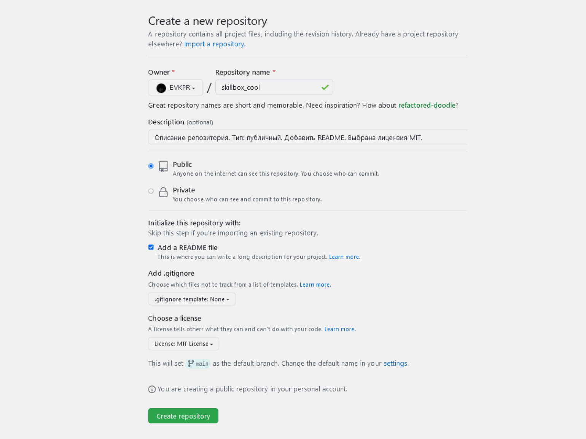
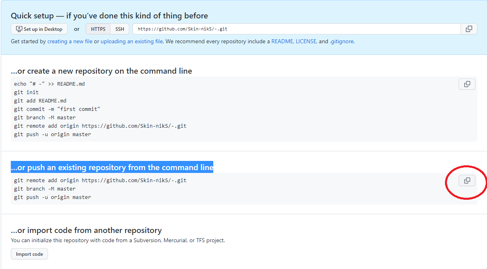
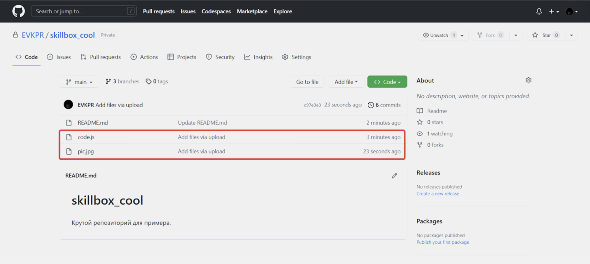

# Инструкция по работе с GitHub.

Данная инструкция создана для освоения базовых работ с GitHub. И состоит из следующих пунктов:

* Что такое GitHub и чем он отличается от Git

* Создание аккаунта в GitHub.

* Создание репозитория и загрузка файлов

* Просмотр файлов в репозитории

* Как использовать webhooks на GitHub?

* Вместо end()

## Что такое GitHub и чем он отличается от Git

GitHub — это облачная платформа для хостинга IT-проектов и совместной разработки, под капотом которой находится популярная система контроля версий Git, а также полноценная социальная сеть для разработчиков. 

Основное отличие от git заключается в том, что вы сохраняете свою работу в облаке. Это создает надежность в сохранении вашего проекта, а также у вас появляется доступ к проекту с любого компьютера.

Платформа позволяет добиться лучшего результата над проектом, т.к. работая в команде каждый сохраняет работу по своему, а руководителю проекта остается только выбрать оптимальный вариант решения.

Git и GitHub — разные сервисы, которые умеют взаимодействовать или работать автономно.

## Создание аккаунта в GitHub.

Для создания аккаунта:
* Перейдите на сайт [github.com](https://github.com);
* Зарегистрируйтесь и верифицируйте адрес электронной почты;
* Выберите тип аккаунта: публичный или приватный;
В публичном аккаунте репозитории видны всем, а в приватном — только тем участникам, которым вы сами открыли доступ.

[Ссылка на подробную инструкцию по созданию аккаунта GitHub](https://learn.microsoft.com/ru-ru/visualstudio/version-control/git-create-github-account?view=vs-2022)

## Создание репозитория и загрузка файлов
Конечно, самый простой способ пользоваться GitHub — через сайт, поэтому начнём отсюда.

Для создания репозитория нужно нажать на + в правом верхнем углу сайта, выбрать пункт New Repository, заполнить название и описание, проставить нужные галочки и щёлкнуть на Create Repository;

А после выполняете действия, которые предлагает Github.

для загрузки файлов нужно зайти в нужный репозиторий, щёлкнуть на Add file и выбрать Upload files.

### Clone

Чтобы работать с репозиторием в вашем персональном компьютере необходимо его скопировать.
Это можно сделать при помощи команды git clone. Для этого нужно открыть репозиторий, щёлкнуть на Code, скопировать ссылку. 

И в вашем редакторе исходного кода (Visual Studio Code), выполнить команду git clone *скопированная ссылка*.

### Push and pull

Команда **git push** позволяет отправлять локальную ветку на удаленный репозиторий. Она помогает разработчикам синхронизироваться в команде, а именно отправляет проделанные изменения. Если программист работает один, то *push* позволяет хранить код в облаке, избавляя от риска потери данных на компьютере.  
Дополнительно для синхронизации еще используют **git pull** для получения изменений с сервера.  
[Подробная информация по использованию команды git push](https://selectel.ru/blog/tutorials/what-is-git-push-and-how-to-use-it/)

### Fork

Если вы хотите внести свой вклад в чужой проект, но у вас нет доступа на запись в репозиторий, вы можете использовать рабочий процесс "fork and pull request".

Форк - это новый репозиторий, который разделяет код и настройки видимости с исходным “восходящим” репозиторием. Форки часто используются для повторения идей или изменений до того, как они будут предложены обратно в вышестоящий репозиторий, например, в проектах с открытым исходным кодом или когда у пользователя нет доступа на запись в вышестоящий репозиторий.

#### pull request
* команда для предложения изменений
* запрос на вливание изменений в репозиторий
#### Как сделать pull request
1. Делаем (ответвление) репозитория *fork*
2. Делаем *git clone* версии репозитория СВОЕЙ
3. Создаем новую ветку и в НЕЕ вносим свои изменения
4. Фиксируем изменения (делаем коммиты)
5. Отправляем свою версию в свой GitHub (*git push*)
6. На сайте GitHub в странице с репозиторием, нажимаем кнопку **pull request**

## Просмотр файлов в репозитории

Для просмотра файлов необходимо выбрать файл в репозитории.
 Просто щёлкните по ним для просмотра!

На этой вкладке вы можете видеть preview, code и blame файла. В blame можно увидеть все коммиты. А в коде - сам код, с нумерациями строк.

## Как использовать webhooks на GitHub?
Webhooks на GitHub могут быть использованы для автоматизации различных процессов, таких как:

— оповещения о новых коммитах или pull request'ах;
— запуск сборки или тестирования вашего кода при каждом push'е в определенную ветку;
— интеграция с сервисами для непрерывной интеграции и развертывания (CI/CD);
— обновление задач в вашей системе управления проектами при изменении статусов pull request'ов и т.д.

* Чтобы создать Webhook на GitHub, нужно выполнить следующие шаги:

1. Открыть страницу настроек вашего репозитория на GitHub.
2. Выбрать пункт "Webhooks" (или "Webhooks & Services")
3. Нажать на кнопку "Add webhook"
4. В поле "Payload URL" указать URL вашего веб-сервера или сервиса, который будет получать информацию о событиях на GitHub.
5. В поле "Content type" выбрать "application/json".
6. В поле "Secret" указать секретный ключ (если нужно).
7. Выбрать список событий, которые вы хотите отслеживать и отправлять на ваш сервер.
8. Нажать на кнопку "Add webhook" для сохранения изменений.

После этого GitHub будет отправлять HTTP POST запросы на ваш сервер с информацией о всех событиях, которые вы выбрали. Вам нужно будет написать веб-хук обработчик на вашем сервере, с помощью которого вы сможете обрабатывать эти запросы и выполнять различные действия на ваш выбор.

## Вместо end()
Всё не так сложно, как может показаться (говоря иносказательно, каждый разработчик в своей жизни сначала учится есть вилкой, а потом — форкать GitHub-репозитории).

GitHub пользуются все: это один из важных общих навыков вне зависимости от выбранного вами языка программирования и направления разработки. И, как и школьные уроки ОБЖ, тот же git clone когда-нибудь вас спасёт.

Поэтому важно начинать пользоваться GitHub как можно раньше — хотя бы даже для бэкапов учебного кода, и уже скоро это станет полезной привычкой.