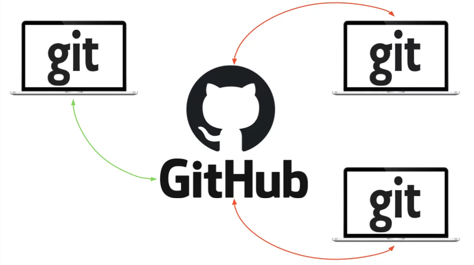
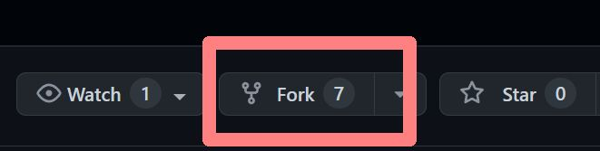
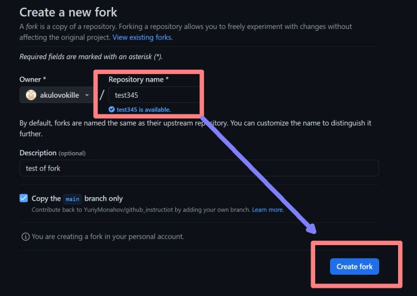
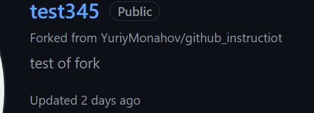

# Инструкция по работе с GitHub
-------------------------------------


- [Инструкция по GitHub](#инструкция-по-github)
  - [Что такое GitHub и чем он отличается от Git](#что-такое-github-и-чем-он-отличается-от-git)
  - [Регистрация и установка](#регистрация-и-установка)
  - [Репозиторий и работа с ним](#репозиторий-и-работа-с-ним)
    - [Что такое репозиторий](#что-такое-репозиторий)
    - [Cоздание репозитория](#cоздание-репозитория)
    - [Изменения в репозитории](#изменения-в-репозитории)
    - [Просмотр файлов в репозитории](#просмотр-файлов-в-репозитории)
  - [Зафиксируйте свое первое изменение](#зафиксируйте-свое-первое-изменение)
  - [Как работать с чужим репозиторием, присоединится к проекту. Pull request.](#как-работать-с-чужим-репозиторием-присоединится-к-проекту-pull-request)
  - [Работа с удаленными репозиториями локально](#работа-с-удаленными-репозиториями-локально)
    - [Просмотр удалённых репозиториев](#просмотр-удалённых-репозиториев)
    - [Настройка удалённых репозиториев](#настройка-удалённых-репозиториев)
  - [Что же такое Codespaces?](#что-же-такое-codespaces)
      - [Для кого это?](#для-кого-это)
    - [Как попасть в Codespaces?](#как-попасть-в-codespaces)
  - [Про devcontainers](#про-devcontainers)
    - [Вливание/предложение изменений в сторонний репозиторий](#вливаниепредложение-изменений-в-сторонний-репозиторий)
  - [Что такое SSH? ](#что-такое-ssh-)

## Что такое GitHub и чем он отличается от Git


**Git** — это система контроля версиями. [GitHub](https://github.com/) это облачная платформа для хранения кода. Здесь можно попрактиковаться в разработке и придумать что-то свое, найти множество open-source проектов, передовых технологий, различных функций и дизайнов. А еще вы можете создавать сайты бесплатно напрямую из репозитория!

GitHub пользуются все: это один из важных общих навыков вне зависимости от выбранного вами языка программирования и направления разработки. И, как и школьные уроки ОБЖ, тот же git clone когда-нибудь вас спасёт.
Поэтому важно начинать пользоваться GitHub как можно раньше — хотя бы даже для бэкапов учебного кода, и уже скоро это станет полезной привычкой.

## Регистрация и установка

Зайдите на GitHub и создайте свой аккаунт. В принципе, этим можно и ограничиться. При желании можете установить Git. Но для работы с GitHub это вовсе не обязательно. Однако если вы планируете заниматься проектами на локальном компьютере, то установка вам все-таки нужна.

## **Репозиторий и работа с ним**

### Что такое репозиторий

**Репозиторий** — это место, в котором вы систематизируете свой проект. Здесь вы храните файлы, папки, видео, изображения, блокноты Jupyter Notebook, наборы данных и т.д.

Загрузить в репозиторий можно всё что угодно, но предполагается, что вы будете хранить в нём файлы с исходным кодом и какие-нибудь дополнительные материалы.

Репозитории могут быть публичными и приватными, в них можно создавать другие папки и отслеживать изменения версий.

Перед началом работы с Git необходимо *инициализировать* репозиторий для проекта и правильно его подготовить. Это можно сделать на сайте GitHub.

Лучше сразу добавлять в репозиторий _**README-файл**_ с информацией о проекте. Это можно сделать в момент создания репозитория, поставив галочку в соответствующем поле.

### Cоздание репозитория

В репозиториях GitHub можно хранить различные проекты, в том числе проекты с открытым исходным кодом. Проекты с открытым исходным кодом позволяют обмениваться кодом для создания более качественного и надежного программного обеспечения. Репозитории можно использовать для совместной работы с другими пользователями и отслеживания своей работы. 

1. В правом верхнем углу любой страницы воспользуйтесь выпадающим меню + и выберите пункт Новое хранилище.


2. Введите короткое, запоминающееся имя вашего репозитория. Например, "hello-world".


3. По желанию добавьте описание вашего репозитория. Например, "Мой первый репозиторий на GitHub".

4. Выберите видимость репозитория. Будет ли он публичный или закрытый.

5. Инициализируйте этот репозиторий с помощью README, для того, чтобы просматривающие ваш репозиторий понимали, о чем тут идёт речь.

6. Нажмите кнопку Создать репозиторий.

**Поздравляем! Вы успешно создали свой первый репозиторий и инициализировали его файлом README.**

### Изменения в репозитории

Вносить изменения в проект можно двумя способами. Изменять файлы/блокноты на компьютере либо делать это на сайте GitHub.

Допустим, вам захотелось подкорректировать README-файл на сайте GitHub.

1. Для начала *перейдите* в ваш репозиторий.
2. Для выбора файла кликните по его названию (например, кликните по **README.md** для перехода к файлу-описанию).
3. В верхнем правом углу вы увидите иконку с карандашом. Нажмите на нее для внесения изменений.
4. Напишите короткое сообщение, передающее суть изменений (и подробное описание, если сочтете это нужным).
5. Нажмите кнопку Commit changes.

Но для обучения Тёмной стороне Силы работе с GitHub полезно потренироваться выполнять и другие необходимые в процессе разработки действия: клонирование/форк, объединение веток, просмотр и разрешение конфликтов и другие.

### Просмотр файлов в репозитории


Согласитесь, что в ряде случаев удобно не скачивать исходники, а просто бегло ознакомиться с ними. Для таких простых операций вовсе не нужен десктопный клиент: все файлы можно быстро открыть в веб-версии (и код, и те же картинки). Просто щёлкните по ним для просмотра!


## Зафиксируйте свое первое изменение
Коммит - это как снимок всех файлов проекта в определенный момент времени.

Когда вы создавали новый репозиторий, вы инициализировали его файлом README. Файлы README - это отличное место для более подробного описания проекта или добавления документации, например, по установке или использованию проекта. Содержимое файла README автоматически отображается на первой странице репозитория.


** Давайте зафиксируем изменения в файле README. **

1. В списке файлов репозитория выберите README.md.


2. В правом верхнем углу окна просмотра файлов щелкните мышью, чтобы открыть редактор файлов.


3. В текстовом поле введите информацию о себе.

4. Над новым содержимым нажмите кнопку Preview (Просмотр).


5. Просмотрите изменения, внесенные в файл. Если выбрать опцию Show diff, то новое содержимое будет выделено зеленым цветом.


6. Нажмите кнопку Зафиксировать изменения.

7. В поле "Сообщение о фиксации" введите короткое, содержательное сообщение о фиксации, описывающее изменения, внесенные в файл. В сообщении о фиксации можно приписать фиксацию более чем одному автору. 

## **Как работать с чужим репозиторием, присоединится к проекту. Pull request.**

*  Получить ссылку на чужой репозиторий (который собираемся клонировать)

* Залогиниться в свой github

* На новой вкладке браузера : копируем в адресную строку ссылку на чужой репозиторий

* В интерфейсе github нажимаем кнопку Fork


* Заполняем форму создания новой "вилки" и нажимаем **Create fork**


* В списке собственных репозиториев появляется ссылка на чужой репозиторий


* Заходим в форк чужого репозитория, нажимаем кнопку Code, на закладке HTTPS копирем адрес форка в clipboard


* На локальной рабочей станции, в терминале VS Code делаем clone своей версии репозитория:
git clone https://github.com/akulovokille/test345.git

* В интерфейсе VS Code (explorer) переходим в клонированный репозиторий

* Создаем новую ветку
_**git branch version2**_

* Переходим в ветку
_**git checkout version2**_

* Открываем какие-либо файлы на редактирование, вносим изменения, сохраняем локально

* Готовим изменные файлы для нового коммита
_**git add**_ .

* Делаем коммит
_**git commit**_ -m "Lines 05 and 10 have been changed"

* Отправляем свою версию в свой GitHub
_**git push**_


* На сайте GitHub нажимаем кнопку **Pull request** для отправки изменений на модерацию хозяину репозитория. 

## Работа с удаленными репозиториями локально
### Просмотр удалённых репозиториев
Для просмотра удаленных репозиториев используется команда _git remote_. В зависимости от выбранных параметров будут отображаться разные данные.
- Команда _git remote_ выведет названия доступных удалённых репозиториев
- Команда _git remote -v_ выведет пути, используемые git для работы с удаленным репозиторием

### Настройка удалённых репозиториев
Команда _git remote set-url <алиас> <url>_ заменяет ссылку для настроенного репозитория на новую.
Пример:
```
$ git remote set-url origin https://github.com/helen-kolegaeva/github_instructions.git
``` 

## Что же такое Codespaces?

Это VSCode у тебя в браузере, запущенный в заранее описанном окружении (devcontainer) или в стандартном, в который входит python, node.js, Docker и прочее. Все это крутится в облаке и бесплатно за первые 60 часов в месяц.

#### Для кого это?
Если у тебя под руками только планшет, хромбук или допотопный ноутбук, то это идеальный вариант, если надо что-то накодить или поправить в проекте, который лежит на гитхабе.

### Как попасть в Codespaces?
Достаточно просто открыть необходимый вам репозиторий и нажать на яркую зеленую кнопку code, перейти в codespaces и тыкнуть в Create codespace on main (ну или на другой бранче)


## Про devcontainers

Devcontainers - расширение для VSCode, которое позволяет использовать Docker-контейнер, как полнофункциональное окружение для разработки. 

### Вливание/предложение изменений в сторонний репозиторий
В больших компаниях один ответственный за проект создает аккаунт. Другие пользователи дают команду *pull request*. Предлагать изменения на GitHub нужно в отдельной ветке. Сначала пользователь копирует репозиторий на свой компьютер, делает fork репозитория, затем клонирует версию на своём ПК, создаёт ветку с предлагаемыми изменениями, отправляет изменения командой push в свой аккаунт на GitHub и даёт команду *pull request*. 


## Как использовать webhooks на GitHub?
Webhooks на GitHub могут быть использованы для автоматизации различных процессов, таких как:

— оповещения о новых коммитах или pull request'ах;
— запуск сборки или тестирования вашего кода при каждом push'е в определенную ветку;
— интеграция с сервисами для непрерывной интеграции и развертывания (CI/CD);
— обновление задач в вашей системе управления проектами при изменении статусов pull request'ов и т.д.

### Чтобы создать Webhook на GitHub, нужно выполнить следующие шаги:

1. Открыть страницу настроек вашего репозитория на GitHub.
2. Выбрать пункт "Webhooks" (или "Webhooks & Services")
3. Нажать на кнопку "Add webhook"
4. В поле "Payload URL" указать URL вашего веб-сервера или сервиса, который будет получать информацию о событиях на GitHub.
5. В поле "Content type" выбрать "application/json".
6. В поле "Secret" указать секретный ключ (если нужно).
7. Выбрать список событий, которые вы хотите отслеживать и отправлять на ваш сервер.
8. Нажать на кнопку "Add webhook" для сохранения изменений.

После этого GitHub будет отправлять HTTP POST запросы на ваш сервер с информацией о всех событиях, которые вы выбрали. Вам нужно будет написать веб-хук обработчик на вашем сервере, с помощью которого вы сможете обрабатывать эти запросы и выполнять различные действия на ваш выбор.

## Что такое SSH? <a name="what_SSH"></a>

С помощью *ssh* можно подключаться к удаленным серверам, выполнять на них команды, копировать и редактировать файлы.


## Инструкция по созданию Pull Request в сторонний GitHub репозиторий

 Сначала нам необходимо склонировать изначальный репозиторий. Для этого перейдем к нему и нажмем кнопку Fork.

Далее склонированный репозиторий нужно скачать на свой компьютер.
git clone https://github.com/slaveeks/rgen

Локальный, скачанный, репозиторий имеет одну привязку к удалённому репозиторию, названную origin, которая указывает копию на GitHub, а не на оригинальный.

Downstream, то есть склонированный репозиторий, должен быть условно  курсе изменений происходящих в оригинальном репозитории, то есть в upstream. Так как разработка там продолжается. Таким образом, необходимо получить изменения (fetch) от upstream и применить к своему origin репозиторию, чтобы не было конфликтов.

Поэтому нужно создать привязку к изначальному репозиторию, чтобы проделать то, о чем сказано выше, и назвать ее любым именем, в этом примере она названа upstream, но это название обязательным не является:
git remote add upstream git://github.com/nOstr/rgen.git
git fetch upstream

После этого рекомендуется создать новую ветку и вносить изменения туда.
git checkout -b feature

Далее нужно внести изменения в сам проект при помощи коммитов.
git add .
git commit -m "My commit"

После этого небходимо отправить изменения в копию репозитория на Github.
git push origin feature

Теперь изменения находятся в копии репозитория на GitHub в ветке feature

## Распространенные ошибки при создании репозитория на Github и как их исправить

Github является одной из самых популярных платформ для хостинга и совместной разработки проектов на базе системы контроля версий Git. Однако, при создании репозитория на Github можно совершить несколько распространенных ошибок. В данной статье мы рассмотрим семь таких ошибок и подробно опишем, как их исправить.

1. **Неправильное именование репозитория**

Одной из самых частых ошибок при создании репозитория на Github является неправильное именование. При выборе имени репозитория следует придерживаться следующих рекомендаций:

* Используйте осмысленное имя, отражающее содержание проекта.

* Избегайте символов, которые могут вызывать проблемы при работе с Git, таких как пробелы или специальные символы.

* Рекомендуется использовать только строчные буквы и дефисы для разделения слов.

* Имя репозитория должно быть уникальным на Github.

Чтобы исправить ошибку неправильного именования репозитория, вы можете изменить его название, перейдя на страницу репозитория и нажав на кнопку "Settings" (Настройки), а затем выбрав "Rename" (Переименовать).

2. **Отсутствие описания проекта**

Еще одной распространенной ошибкой является отсутствие описания проекта. Описание проекта позволяет другим разработчикам лучше понять его цель и содержание. Кроме того, описание проекта важно для поиска по репозиториям на Github.

Чтобы исправить ошибку отсутствия описания проекта, вы можете перейти на страницу репозитория, нажать на кнопку "Edit" (Редактировать) около названия репозитория, а затем добавить описание в поле "Description" (Описание).

3. **Неправильная установка "gitignore"**

Файл ".gitignore" позволяет задать правила игнорирования файлов Git. Нередко при создании репозитория разработчики забывают создать или настроить файл ".gitignore", и, как результат, их репозиторий может содержать ненужные файлы, такие как данные конфигурации или временные файлы.

Чтобы исправить ошибку неправильной установки "gitignore", вы можете создать файл ".gitignore" в корне вашего репозитория или использовать готовые шаблоны, доступные на сайте github/gitignore. Убедитесь, что актуальный файл ".gitignore" находится в корне вашего репозитория.

4. **Отсутствие лицензии**

Отсутствие лицензии в репозитории может вызвать проблемы с использованием кода другими разработчиками. Лицензия определяет права и ограничения на использование вашего кода. Без лицензии другие разработчики могут предполагать, что ваш код защищен авторским правом и использование может быть запрещено.

Чтобы исправить ошибку отсутствия лицензии, вы можете добавить файл "LICENSE" или "LICENSE.md" в корень вашего репозитория. Выберите наиболее подходящую лицензию для вашего проекта из открытых источников, таких как choosealicense.com.

5. **Неверное управление правами доступа**

Если репозиторий содержит конфиденциальную информацию или вы не хотите, чтобы другие разработчики имели полный доступ к вашему коду, это может привести к проблемам безопасности или несанкционированному распространению кода.

Чтобы исправить ошибку неверного управления правами доступа, вы можете настроить правила доступа в настройках вашего репозитория. Вы можете предоставить доступ только определенным пользователям или организациям, задать правила для сотрудничества и управления запросами на слияние.

6. **Неправильное размещение файловой структуры**

Неправильное размещение файлов и директорий в репозитории может затруднить навигацию и понимание структуры проекта другим разработчикам. Это также может вызвать проблемы при слиянии изменений и обновлении кода.

Чтобы исправить ошибку неправильной файловой структуры, следует стремиться к определенным соглашениям о структуре проекта в вашей команде или сообществе. Размещайте файлы и директории логически и последовательно, чтобы упростить понимание проекта другими разработчиками.

7. **Отсутствие регулярных обновлений**

Еще одной ошибкой является отсутствие регулярных обновлений репозитория. Проекты на Github обычно разрабатываются совместно, и редкий или отсутствующий обновление может указывать на неактивность проекта или потерю интереса разработчиков.

Для исправления ошибки отсутствия регулярных обновлений рекомендуется регулярно вносить изменения в ваш репозиторий. Это может быть включение новых функций, исправление ошибок или обновление документации. Вы также можете обозначать время для регулярного обновления вашего репозитория, чтобы поддерживать активность проекта и привлекать других разработчиков.

В заключение, исправление этих семи распространенных ошибок при создании репозитория на Github поможет улучшить качество вашего проекта, упростить совместную работу и повысить его видимость в сообществе разработчиков.

## Инструкция по работе с Github

+ Перейдите на сайт GitHub. Нажмите на значок + в верхнем правом углу, а затем выберите New repository.

+ Придумайте имя репозитория и добавьте короткое описание.

+ Решите, будет ли этот репозиторий размещаться в открытом доступе или останется закрытым для просмотра.

+ Нажмите Initialize this repository with a README для добавления README-файла. Настоятельно рекомендую снабжать все ваши проекты файлом-описанием, ведь README — это первая вещь, на которую люди обращают внимание при просмотре репозитория. К тому же, здесь можно разместить нужную информацию для понимания или запуска проекта.


Допустим, вам захотелось подкорректировать README-файл на сайте GitHub.

+ Для начала перейдите в ваш репозиторий.
+ Для выбора файла кликните по его названию (например, кликните по README.md для перехода к файлу-описанию).
+ В верхнем правом углу вы увидите иконку с карандашом. Нажмите на нее для внесения изменений.
+ Напишите короткое сообщение, передающее суть изменений (и подробное описание, если сочтете это нужным).
+ Нажмите кнопку Commit changes.

Для клонирования репозитория на компьютер перейдите в репозиторий на GitHub и нажмите большую зеленую кнопку под названием Clone or download (разумеется, вы можете просто скачать репозиторий и избежать всех заморочек с терминалом. Но я в вас верю, поэтому не будем сдаваться!). Проследите, чтобы появилась надпись Clone with HTTPS. Теперь нажмите на иконку буфера обмена для копирования-вставки (либо выделите ссылку и скопируйте ее).


Клонирование или скачивание репозитория
Откройте терминал и перейдите в директорию для копирования репозитория. Например, для перехода на Рабочий стол напечатайте вот это:

> cd Desktop

Затем клонируйте туда репозиторий по следующей команде:

> git clone <то,_что_вы_только_что_скопировали>

Все просто! Не забудьте изменить информацию в угловых скобках на нужную вам. И удалите сами скобки < >.

Если вы не очень хорошо ориентируетесь в терминале, то переход по директориям можно осуществлять через команду cd. Например, откройте терминал и напечатайте ls для отображения перечня доступных директорий. Вполне возможно, что в этом списке вы сразу увидите директорию Desktop. Либо напечатайте cd Desktop. Далее выполните команду git clone и склонируйте репозиторий на Рабочий стол.

Бывает и так, что вместо перечня расположений, вы видите различные имена пользователей. Тогда до того, как перейти в Desktop, вам потребуется выбрать нужного пользователя через команду cd <пользователь> (замените <пользователь> на нужное вам имя). Затем снова напечатайте ls, чтобы увидеть весь список. И вот теперь, увидев в списке Desktop, смело печатайте cd Desktop. Сейчас уже можно выполнять git clone!

Если вдруг в терминале вы захотите «откатиться» на шаг назад, то напишите cd ..

Новый GitHub-репозиторий, склонированный на рабочий стол, готов! Данная команда создает точную копию репозитория в вашей системе. Здесь вы сможете с ним работать, редактировать, индексировать изменения, создавать коммиты с изменениями и отправлять их на GitHub.

Совсем не обязательно создавать репозиторий на Рабочем столе. Клонировать можно в любое место на компьютере. Команду git clone можно выполнять и сразу после открытия терминала. Однако, если вы не очень любите копаться в папках на компьютере, то неплохо будет разместить проект на виду, то есть на Рабочем столе…

Если хотите просто покопаться в каком-то проекте, то вместо клонирования можете сделать форк проекта на GitHub. Для этого нажмите кнопку Fork в верхнем правом углу сайта. Так вы добавите копию этого проекта в свои репозитории и сможете вносить туда любые изменения без вреда для оригинала.

## Инструкция по работе с Github

+ Перейдите на сайт GitHub. Нажмите на значок + в верхнем правом углу, а затем выберите New repository.

+ Придумайте имя репозитория и добавьте короткое описание.

+ Решите, будет ли этот репозиторий размещаться в открытом доступе или останется закрытым для просмотра.

+ Нажмите Initialize this repository with a README для добавления README-файла. Настоятельно рекомендую снабжать все ваши проекты файлом-описанием, ведь README — это первая вещь, на которую люди обращают внимание при просмотре репозитория. К тому же, здесь можно разместить нужную информацию для понимания или запуска проекта.


Допустим, вам захотелось подкорректировать README-файл на сайте GitHub.

+ Для начала перейдите в ваш репозиторий.
+ Для выбора файла кликните по его названию (например, кликните по README.md для перехода к файлу-описанию).
+ В верхнем правом углу вы увидите иконку с карандашом. Нажмите на нее для внесения изменений.
+ Напишите короткое сообщение, передающее суть изменений (и подробное описание, если сочтете это нужным).
+ Нажмите кнопку Commit changes.

Для клонирования репозитория на компьютер перейдите в репозиторий на GitHub и нажмите большую зеленую кнопку под названием Clone or download (разумеется, вы можете просто скачать репозиторий и избежать всех заморочек с терминалом. Но я в вас верю, поэтому не будем сдаваться!). Проследите, чтобы появилась надпись Clone with HTTPS. Теперь нажмите на иконку буфера обмена для копирования-вставки (либо выделите ссылку и скопируйте ее).


Клонирование или скачивание репозитория
Откройте терминал и перейдите в директорию для копирования репозитория. Например, для перехода на Рабочий стол напечатайте вот это:

> cd Desktop

Затем клонируйте туда репозиторий по следующей команде:

> git clone <то,_что_вы_только_что_скопировали>

Все просто! Не забудьте изменить информацию в угловых скобках на нужную вам. И удалите сами скобки < >.

Если вы не очень хорошо ориентируетесь в терминале, то переход по директориям можно осуществлять через команду cd. Например, откройте терминал и напечатайте ls для отображения перечня доступных директорий. Вполне возможно, что в этом списке вы сразу увидите директорию Desktop. Либо напечатайте cd Desktop. Далее выполните команду git clone и склонируйте репозиторий на Рабочий стол.

Бывает и так, что вместо перечня расположений, вы видите различные имена пользователей. Тогда до того, как перейти в Desktop, вам потребуется выбрать нужного пользователя через команду cd <пользователь> (замените <пользователь> на нужное вам имя). Затем снова напечатайте ls, чтобы увидеть весь список. И вот теперь, увидев в списке Desktop, смело печатайте cd Desktop. Сейчас уже можно выполнять git clone!

Если вдруг в терминале вы захотите «откатиться» на шаг назад, то напишите cd ..

Новый GitHub-репозиторий, склонированный на рабочий стол, готов! Данная команда создает точную копию репозитория в вашей системе. Здесь вы сможете с ним работать, редактировать, индексировать изменения, создавать коммиты с изменениями и отправлять их на GitHub.

Совсем не обязательно создавать репозиторий на Рабочем столе. Клонировать можно в любое место на компьютере. Команду git clone можно выполнять и сразу после открытия терминала. Однако, если вы не очень любите копаться в папках на компьютере, то неплохо будет разместить проект на виду, то есть на Рабочем столе…

Если хотите просто покопаться в каком-то проекте, то вместо клонирования можете сделать форк проекта на GitHub. Для этого нажмите кнопку Fork в верхнем правом углу сайта. Так вы добавите копию этого проекта в свои репозитории и сможете вносить туда любые изменения без вреда для оригинала.