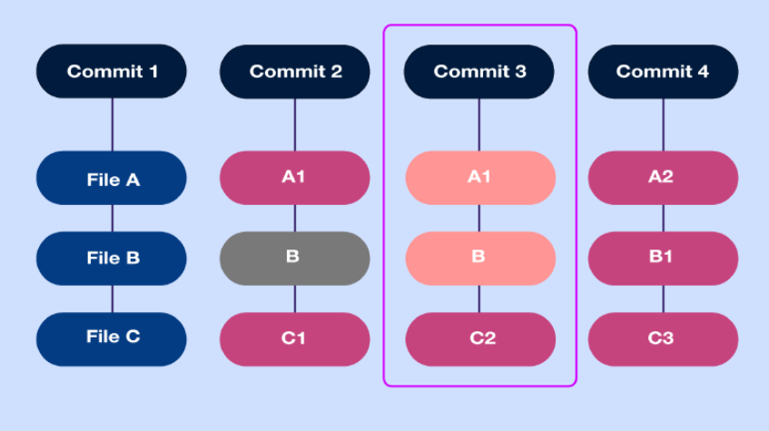
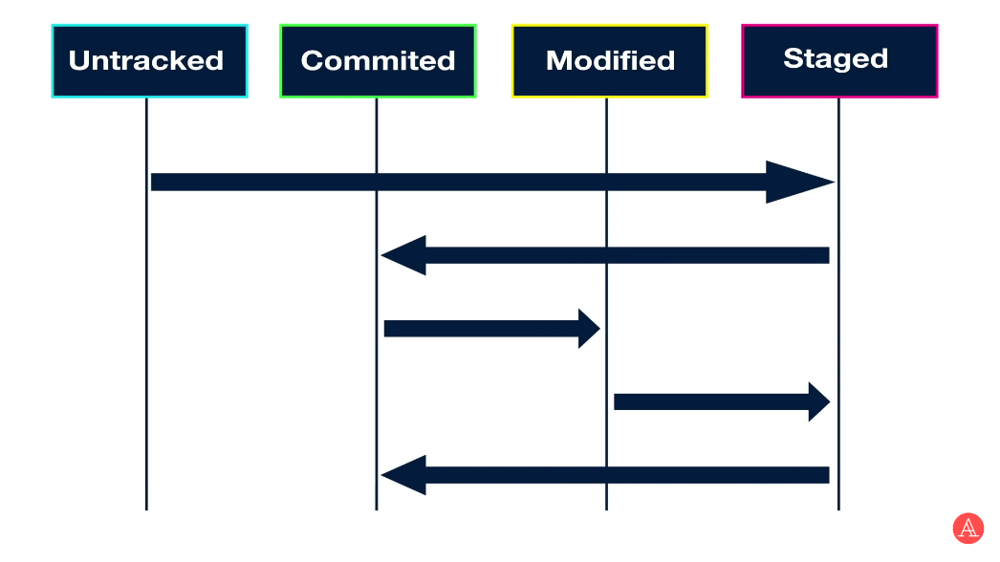
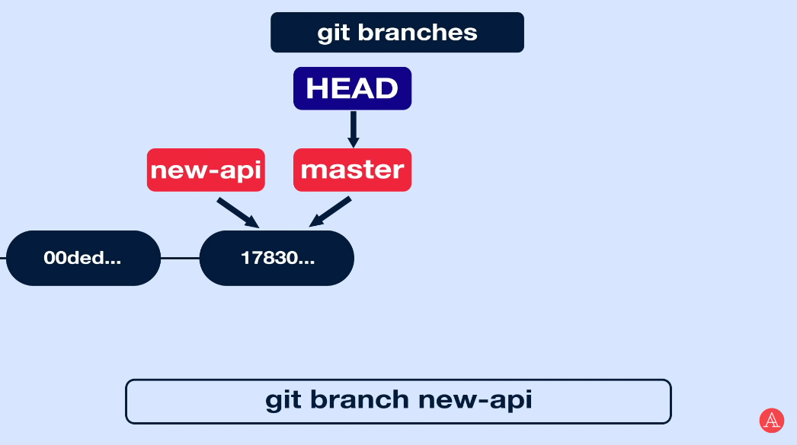
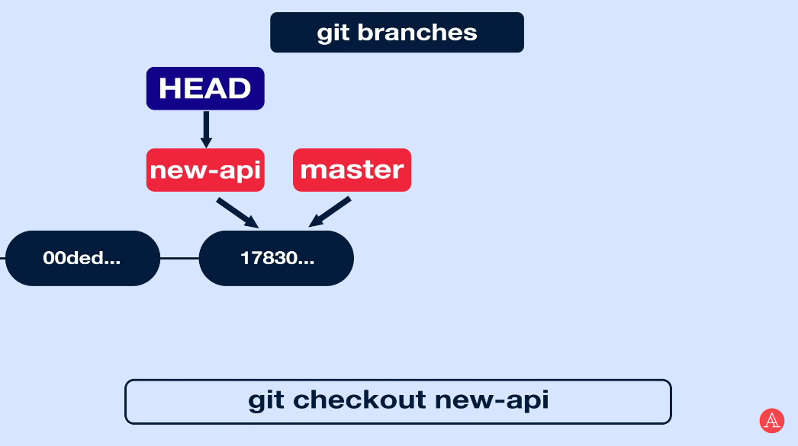
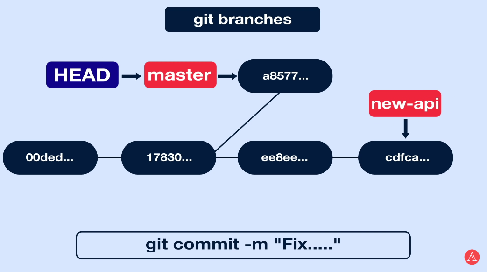

# Инструкция для работы с Git и удалёнными репозиториями


Что такое Git? Git - это одна из реализаций распределённых систем контроля версий, имеющая как и локальные, так и удалённые репозитории. Является самой популярной реализацией систем контроля версий в мире. В этом файле мы рассмотрим основы работы с гит и с удалёнными репозиториями (на примере GitHub).

Как работает гит? Каждый раз, когда мы сохраняем состояние проекта, Git запоминает как выглядит каждый файл в этот момент времени, как бы делая снимок всего проекта (замораживая его) и сохраняет ссылку на этот снимок, его еще можно назвать коммитом (commit).



Каждый раз, когда Вы делаете коммит, Git сначала вычисляет хеш сумму этого коммита и только потом сохраняет информацию. При этом в коммите есть ссылка на предыдущий коммит - его хеш сумма. Так Git обеспечивает целостность истории изменений. Поэтому даже если кто-то хоть что-нибудь изменит в любом коммите из цепочки, его хеш сумма полностью изменится и придется переписывать уже всю последующую историю коммитов, что не останется незамеченным.


# Разделы инструкции:

- [Настройка git](#настройка-git)
- [Подготовка репозитория](#подготовка-репозитория)
- [Создание коммитов](#создание-коммитов)
- [Перемещение между сохранениями](#перемещение-между-сохранениями)
- [Журнал изменений](#журнал-изменений)
- [Ветки в Git](#ветки-в-git)
- [Создание репозитория GitHub](#создание-репозитория)
- [Работа с удалённым репозиторием](#работа-с-удалённым-репозиторием)
- [Предложение и вливание изменений в сторонний репозиторий](#предложение-и-вливание-изменений-в-сторонний-репозиторий)

# Настройка git

После установки гита мы можем проверить его версию:

```
git --version
```


Чтобы получить помощь по командам git, нужно ввести следующую команду:

```
git --help
```

Также перед началом работы с гитом надо указать свои данные (для того, чтобы он мог впоследствие проводить коммиты и заливать данные на удаленный сервер GitHub). Данные можно указать, грубо говоря, в три разные "зоны видимости":

- "git config --system" - для всех пользователей системы настройки
- "git config --global" - настройки для конкретного пользователя
- "git config --local" - настройки для текущего репозитория


```
git config --global user.name "Ваш юзернейм"
git config --global user.email "Ваш email"
```

Впоследствии можно проверить, какой сейчас юзернейм и емейл, вбив такую же команду, только без указания данных:

```
git config --global user.name
git config --global user.email
```

# Запись изменений в репозиторий

Что такое репозиторий? Это хранилище файлов, которое поддерживает версионность; просто корневая папка с файлами и вложенными директориями вашей программы. Загрузить в репозиторий можно всё что угодно, но предполагается, что вы будете хранить в нём файлы с исходным кодом и какие-нибудь дополнительные материалы — допустим, необходимую для GUI или вёрстки графику (картинки, иконки и тому подобное).

Для создание репозитория необходимо выполнить команду `git init` в папке с репозиторием, и у вас создастся репозиторий (появится скрытая папка `.git`)

Причем неважно, создаём ли мы репозиторий в пустой папке, или создаём его в папке с уже существующими файлами. Это команда - команда гиту, что надо начать отслеживание файлов в этом каталоге

## git status

Для того, чтобы посмотреть состояние репозитория используется команда `git status`. Для этого необходимо в папке с репозиторием написать `git status`, и вы увидите были ли измения в файлах, или их не было.

Если мы сделали git status в пустой папке, то мы увидим следующее:

```
C:\Users\user1\Desktop\git_edu>git status
On branch master

No commits yet

nothing to commit (create/copy files and use "git add" to track)
```

1) Мы находимся в ветке master
2) Нет никаких коммитов
3) Нечего коммитить

Далее. Допустим, мы создали в репозитории файл file1.md и сохранили его. Пишем команду git status. Что мы увидим?

```
On branch master

No commits yet

Untracked files:
  (use "git add <file>..." to include in what will be committed)
        file1.md

nothing added to commit but untracked files present (use "git add" to track)
```

1) Мы находимся в мастер ветке
2) Пока нет никаких коммитов - мы не зафиксировали никаких изменений
3) Есть **неотслеживаемый файл** - тот, который мы только что добавили

То есть статус файла, который мы добавили - неотслеживаемый (`untracked`). А какие вообще статусы могут быть у файлов в git?

1) `untracked` - это файлы, которые не отслеживаются гитом (просто висят в папке, грубо говоря)
2) `tracked` - отслеживаемые
	1) `staged` - это файлы, которые были добавлены в индекс с помощью git add (грубо говоря, добавлены в "корзину"), для того, чтобы потом их закоммитить. То есть такое, положение "готовности" для коммита
	2) `commited` - это файлы, которые закоммичены
	3) `modified` - это когда файл (уже ранее закоммиченный или новый который был добавлен в индекс) был изменён, но ещё не попал в коммит



## Git add

Для того, чтобы закоммитить файл, надо сначала добавить его "в корзину" - в индекс. Делается это с помощью команды `git add`. Чтобы использовать команду `git add`, напишите `git add <имя файла>`.

> Чтобы добавить сразу все unstaged/modified файлы в индекс (то есть сделать их staged) можно не писать каждый файл git add <имя файла>, а просто написать:
> 
> git add .

## git commit

Когда ваш индекс ("корзина") находится в таком состоянии, как вам и хотелось, вы можете зафиксировать свои изменения. Запомните, всё, что до сих пор не проиндексировано — любые файлы, созданные или изменённые вами, и для которых вы не выполнили `git add` после редактирования — не войдут в этот коммит. Они останутся изменёнными файлами на вашем диске. Простейший способ зафиксировать изменения — это набрать `git commit`. Выполняется она так: `git commit -m "<сообщение к коммиту>"`. Все файлы для коммита должны быть ДОБАВЛЕНЫ и сообщение к коммиту писать ОБЯЗАТЕЛЬНО.

Если мы после этого внесём изменения в файл и снова закоммитим, у нас появится второй коммит, который будет ссылаться на первый; потом создадим ещё один - тогда третий будет ссылаться на второй и так далее. Таким образом, у нас создаётся цепочка из коммитов.

# Перемещение между сохранениями (версиями)

## Журнал изменений

Для того, чтобы посмтреть все сделанные изменения в репозитории, используется команда `git log`. Она выдаст нам весь список изменений, где наверху будет самый последний коммит, а внизу - самый первый. В каждом коммите нам покажет:

1) Автора изменений
2) Дату изменений
3) Хэш-сумму коммита
4) Сообщение коммита

## git checkout

Для того, чтобы перемещаться между коммитами, используется команда `git checkout`. Используется она в папке с репозиторием следующим образом: `git checkout <номер коммита>`

После введения этой команды, git автоматически вернёт нам состояние рабочего каталога на момент указанного коммита: все изменения, котоыре мы сделали после этого коммита, все новые файлы и папки - ничего этого в этом коммите не будет.

Помни, что чтобы дальше работать с репозиторием, нам надо вернуться в его актуальное состояние (то есть в последний коммит). Для того, чтобы вернуться в последний коммит, надо написать следующую команду: `git checkout master` (если мы находимся в ветке master; про работу с ветками читай ниже).

# Ветки в Git

## Создание веток

Структура Git представлена в виде дерева - есть одна главная ветка с изменениями (по умолчанию она, обычно, называется master), от которой могут отходить другие ветки (в которых тоже находятся изменения). Если у нас одна ветка коммитов, то каждый коммит просто ссылается на свой родительский коммит:


Чтобы проверить, в какой ветке мы находимся (и какие ветки вообще есть в репозитории), надо написать команду `git branch` (звёздочка указывает на текущую ветку).

```
git branch
  main
* redaction
```

При введении команды `git log`, о которой мы говорили ранее, указатель HEAD показывает не только на коммит, но и на ветку:


Когда мы создаём новую ветку (c помощью команды `git branch <название ветки>`), она добавляется на последний коммит



Чтобы перейти на вновь созданную ветку, надо написать команду `git checkout <название ветки>`:



Когда мы добавляем коммиты в новую ветку, указатель HEAD вместе с указателем ветки перемещается вперёд - а указатель изначальной ветки (из которой мы отвели новую), остаётся как бы "позади":


Если мы напишем команду `git checkout master`, то состояние репозитория вернётся на состояние последнего коммита в ветке `master`, а все изменения, которые мы внесли в ветку `new-api` в этом примере, нам видны не будут:


Если мы теперь сделаем новый коммит, но уже в ветке `master`, структура нашего git будет выглядеть вот так:



## Слияние веток

Для того чтобы добавить ветку в текущую ветку используется команда `git merge`. Допустим мы делаем merge с веткой bugfix (merge пишется из той ветки, В КОТОРУЮ мы хотим добавить новую инфу; то есть если мы хотим в мастер добавить информацию из bugfix, надо сначала перейти в ветку master)


В данном случае, так как последний коммит ветки master являлся прямым родителем последнего коммита ветки bugfix, мы просто переместили голову ветки master на последний коммит bugfix'a


После такого ветка bugfix нам больше не нужна, и мы можем её удалить: `git branch -d bugfix`. А что если мы теперь захотим слить ветку master с веткой new-api? Простым переносом (fast forward) мы больше этого сделать не сможем, так как в таком случае мы больше не можем сдвинуть указатель мастера вперёд, так как последний коммит мастера больше не является прямым родителем последнего коммита new-api.

Чтобы теперь слить ветки master и new-api команда делаем ту же - `git merge`, но путь теперь будет немного другой.


Мы видим теперь, что у нового коммита теперь два родителя (два родительских коммита) вместо одного. Такой коммит называется merge commit.

## Merge конфликты

Иногда слияние происходит гладко (без конфликтов). Но что если в разных ветках один и тот же текст написан по разному? Когда мы эти ветки будем сливать у нас возникнет конфликт - гит не поймет, какую из этих версий надо использовать. При merge конфликте гит автоматически не сможет соединить коммиты, и предложит нам решить их вручную. Мы можем выбрать один из следующих вариантов:

- `Accept Current Change` - сохранить то, что находится в ветке, в которую мы вливаем данные
- `Accept Incoming Change` - сохранить то, что "пришло" из другой ветки
- `Accept Both Changes` - сохранить оба изменения

Также мы можем вручную полностью изменить текст и сохранить его - это тоже будет решением merge конфликта.

После того, как мы в редакторе вручную разрешили конфликт, надо файл сохранить. Разрешив каждый конфликт во всех файлах, запустите `git add` для каждого файла, чтобы отметить конфликт как решённый. Добавление файла в индекс означает для Git, что все конфликты в нём исправлены.

Если вас всё устраивает — выполните команду `git commit` для создания коммита слияния.

> Merge-конфликты довольно часто возникают в работе, поэтому у проекта должен быть один ответственный человек, который будет заниматься слиянием веток

# Создание  удалённого репозитория

*Чтобы разместить проект на GitHub, необходимо создать репозиторий, чтобы он функционировал.*

В репозиториях GitHub можно хранить различные проекты, включая проекты с открытым исходным кодом. С проектами с открытым исходным кодом вы можете обмениваться кодом для создания лучшего и более надежного программного обеспечения. Вы можете использовать репозитории для совместной работы с другими пользователями и отслеживания своей работы.

* В правом верхнем углу любой страницы воспользуйтесь  выпадающим меню и выберите Новый репозиторий.


* Введите короткое, запоминающееся название для вашего репозитория. Например, "hello-world".


* При желании добавьте описание вашего репозитория. Например, "Мой первый репозиторий на GitHub".
* Выберите видимость репозитория. (публичный или приватный)
* Нажмите Создать репозиторий.

# Работа с удалённым репозиторием

Что такое GitHub и чем он отличается от Git? GitHub — это облачная платформа для хостинга IT-проектов и совместной разработки, под капотом которой находится популярная система контроля версий Git, а также полноценная социальная сеть для разработчиков.

Здесь можно найти кучу open-source-проектов на разных языках и поучаствовать в них, разместить своё портфолио с примерами кода, чтобы приложить ссылку к резюме, подглядывать в открытых проектах интересные архитектурные решения, смотреть, как опытные разработчики пишут код, и скачивать огромное количество полезных в разработке и бесплатных инструментов для разработки.

Придя практически в любую IT-компанию, вы столкнётесь с тем, что код где-то хранится — и в подавляющем большинстве случаев этим «где-то» будет именно GitHub. У GitHub есть довольно известный конкурент — GitLab, он тоже основан на Git, но это разные платформы разных компаний, хотя их функциональность очень похожа.

А ещё не стоит путать GitHub и Git. GitHub — лишь одна из реализаций системы контроля версий Git, в которую добавлено много удобных инструментов и возможностей (те же комментарии, issues, гиперссылки, форматированный текст и тому подобное). Помните, GitHub можно использовать и без знания Git (обратное тоже верно).

Ну как, звучит круто? Тогда приступайте к нашему гайду о том, как пользоваться GitHub, чтобы во всём разобраться и вообще понять, нужен ли он вам прямо сейчас.

## Клонирование репозитория

Копировать внешний репозиторий на свой ПК можно командой *git clone*

>Команда git clone составная: она не только загружает все изменения, но и пытается слить  все ветки на локальном компьютере и в удаленном репозитории.

## Получение изменений из удаленного репозитория

Что скачать изменения из удалённого репозитория необходимо выполнить команду *git pull*

>Эта команда позволяет скачать все из текущего репозитория и автоматически сделать merge с нашей версией

## Отправка изменений во внешний репозиторий

Перенос изменений-коммитов из локального репозитория (на вашем ПК) на удалённый (remote repository, то есть в данном случае на GitHub) называется «пуш» (push — от английского «толкать» (дословно — «проталкивать» изменения)).

Отправить свою версию репозитория во внешний репозиторий поможет команда *git push*. **При первом её использовании нужна авторизация.**

>Эта команда позволяет отправить нашу версию репозитория на внешний репозиторий. **ТРЕБУЕТ АВТОРИЗАЦИИ на внешнем репозитории.**

# Предложение и вливание изменений в сторонний репозиторий

В больших компаниях один ответственный за проект создает аккаунт. Другие пользователи дают команду *pull request*. Предлагать изменения на GitHub нужно в отдельной ветке. Сначала пользователь копирует репозиторий на свой компьютер, делает fork репозитория, затем клонирует версию на своём ПК, создаёт ветку с предлагаемыми изменениями, отправляет изменения командой push в свой аккаунт на GitHub и даёт команду *pull request*.
#### pull request

* команда для предложения изменений
* запрос на вливание изменений в репозиторий
#### Как сделать pull request

* Делаем ответвление репозитория с помощью **fork**
* Делаем *git clone* свой версии репозитория
* Создаем новую ветку и в НЕЕ вносим свои изменения
* Фиксируем изменения (делаем коммиты)
* Отправляем свою версию в свой GitHub
* На сайте GitHub нажимаем кнопку **pull request**