# Инструкция для работы с Git и удалёнными репозиториями

## Оглавление

1. [Git](#git) 
    + [Что такое Git?](#what_git) 
    + [Подготовка репозитория](#prepare_repo)
    + [Создание коммитов](#commit)
        - [Git Add](#git_add)
        - [Подготовка репозитория](#git_status)
        - [Создание коммитов](#create_commit)
        - [Исправление полседнего коммита](#amend)
        - [Перемещение между сохранениями](#go_to_save)
        - [Журнал изменений](#log)
    + [Редактирование истории](#redact_his)
    + [Редактирование истории](#redact_his)
    + [Редактирование истории](#branches)
        - [Создание ветки](#create_branch)
        - [Слияние веток](#merge_branch)
        - [Удаление веток](#del_branch)
    + [Специальные файлы .gitignore и .gitkeep](#gitignore_gitkeep)
    + [Если .gitignore не работает](#gitignore_error)
2. [GitHub](#GitHub)
    + [Что такое GitHub?](#what_GitHub)
    + [Создание репозитория на GitHub](#create_repo_GitHub)
    + [Подключение репозитория](#link_connect_repo_GitHub)
    + [Отправка данных на удаленный репозиторий](#push_GitHub)
        - [Удаление веток в удаленном репозитории](#push_del_GitHub)
    + [Получение данных из удаленнх репозитория](#pull_GitHub)
    + [Получение данных из удаленнх репозитория](#pull_GitHub)
    + [fork](#fork)
    + [Pull request](#pull_request)
    + [Codespaces](#codespace)
        - [Как попасть в Codespaces](#why_open_codespaces)
        - [Devcontainers](#devcontainers)
    + [Возможные ошибки](#codespace)
        - [Если возникает ошибка fatal: Could not read from remote repository](#errors1)
        - [Если .gitignore не работает](#gitignore_errors)
3. [Дополнительные материалы](#more_info)

## Git 

### Что такое Git? 

Git - это одна из реализаций распределённых систем контроля версий, имеющая как и локальные, так и удалённые репозитории. Является самой популярной реализацией систем контроля версий в мире.

### Подготовка репозитория 

Для создание репозитория необходимо выполнить команду *git init* в папке с репозиторием и у Вас создаться репозиторий (появится скрытая папка .git)

Если ранее вы не указали Имя Пользователя и Email, то нужно:\
*git config --global user.name* <имя пользователя> \
*git config --global user.email* <email пользователя>

### Создание коммитов 

#### Git add 

Для добавления измений в коммит используется команда *git add*. Чтобы использовать команду git add напишите *git add* <имя файла>

#### Просмотр состояния репозитория 

Для того, чтобы посмотреть состояние репозитория используется команда *git status*. Для этого необходимо в папке с репозиторием написать *git status*, и Вы увидите были ли измения в файлах, или их не было.

#### Создание коммитов 

Для того, чтобы создать коммит(сохранение) необходимо выполнить команду *git commit*. Выполняется она так: *git commit -m* <сообщение к коммиту>. Все файлы для коммита должны быть ДОБАВЛЕНЫ и сообщение к коммиту писать ОБЯЗАТЕЛЬНО.

#### Исправление полседнего коммита 

Для этого после *git commit* надо написать *--amend -m* и после этого написать новый текс коммита.
Вот так:
*git commit --amend -m* <новвый текст коммита>

#### Удаление коммитов 
Ввести:\
*git reset --hard* <хеш коммита к которому мы откатим измения до него»>\
*git push --force*

#### Перемещение между сохранениями 

Для того, чтобы перемещаться между коммитами, используется команда *git checkout* или *git switch*. Используется она в папке с пепозиторием следующим образом: *git checkout* <номер коммита>; *git switch* <номер коммита>;

#### Журнал изменений 

Для того, чтобы посмтреть все сделанные изменения в репозитории, используется команда *git log*. Для этого достаточно выполнить команду *git log* в папке с репозиторием. Можно добавть параметры --oneline для того, чтобы при выводе журнала хеш коммитов в сокращенном виде. Иди --graph для того, чтобы вывести историю ввиде графа.\
*git reflog* – показывает более подробную историю. *git log* – показывает лишь историю коммитов. 

### Редактирование истории 

*git reset* <хеш коммита> – откатывает изменения к выбранному commit.\
*git revert* <хеш коммита> – создает commit отменяющий последствия указанного commit (после вызова открывает редактор для commit (выйти “:wq”)).\
*git restore* <имя файла> – сбрасывает состояние файла до последнего commit. 

### Ветки в Git 

#### Создание ветки 

Для того, чтобы создать ветку, используется команда *git branch*. Делается это следующим образом в папке с репозиторием: *git branch* <название новой ветки>\
Или использовать git checkout -b <имя ветки> – переходит к указанной ветке, но если ее нет, то создает ее.

#### Слияние веток 

Для того чтобы дабавить ветку в текущую ветку используется команда *git merge* или\
git rebase <имя ветки в конец которой хоти добавить> – переписывает последний commit указанной ветки, для того чтобы переместить начало текущей ветки в конец указанной. Пример,  git rebase master. 

#### Удаление веток 
Для удаления ветки ввести команду *git branch* -d 'name branch'

### Специальыне файлы .gitignore и .gitkeep 
В Git есть два зарезирвированных специальных файла:

*.gitkeep* – сохраняет пустые директории в общий индексе (репозиторий).\
*.gitignore* – игнорирует определенные файлы от попадания в общий индекс.

*.gitkeep* и *.gitignore* создаются при помощи touch/вручную в редакторе/вручную в проводнике и добавляются в индекс через add. 

**!! Важно: не добавлять предпологаемо игнорируемые файлы в индекс, во избежании ошибок работы *.gitignore***

## GitHub 

### Что такое GitHub? 

GitHub — крупнейший веб-сервис для хостинга IT-проектов и их совместной разработки.

Веб-сервис основан на системе контроля версий Git и разработан на Ruby on Rails и Erlang компанией GitHub, Inc (ранее Logical Awesome). Сервис бесплатен для проектов с открытым исходным кодом и (с 2019 года) небольших частных проектов, предоставляя им все возможности (включая SSL), а для крупных корпоративных проектов предлагаются различные платные тарифные планы.

### Создание репозитория на GitHub 

**!!!** Для этого нужно зарегистрироваться на GitHub. 

1. Перейти в меню создания репозитория:
* Перейти на Dashboaed и в панеле Top Repositories нажать на кнопку New 

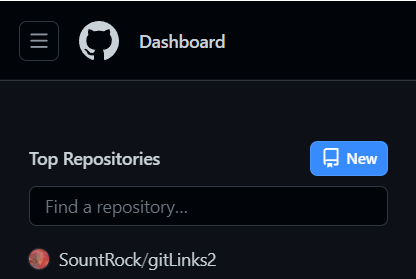

 

+ Или перейти в Repositories и так же нажать New

 

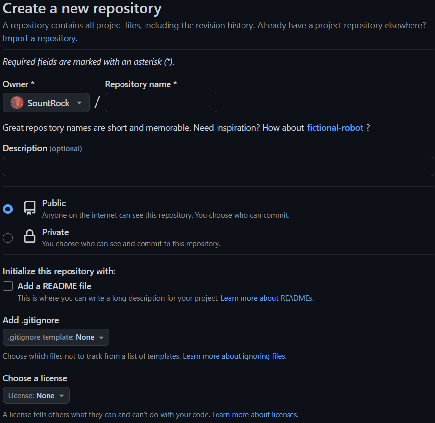

3. Указать имя репозитория без пробелов и на английском.
4. Указать открытость репозитория: публичный или приватный. 
5. Задать прочии дополнительные парамтры: Description, Add .gitignore и т.д. 
6. Нажать Create Repository

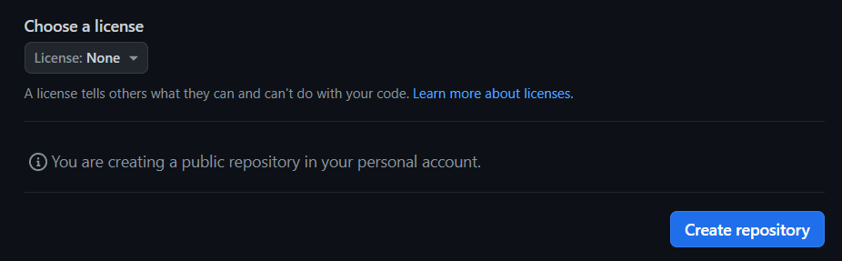

**!!** Если вы выберите пункт Add a README file вас полсле Нажатия Create Repository вас сразу перекинут к вашему репозиторий в привычном виде. 

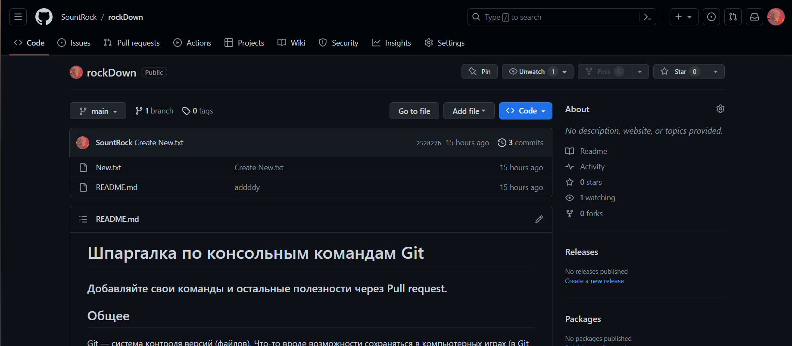

Если вы этого не сделали то вам предложат несколько вариантов:

Выберите подходящий. 

### Подключение репозитория с GitHub 

#### Способ 1:

**В локальном репозитории:**
1. Сгенерировать специальный уникальный ключ:\
В локальном репозитории ввести комманду *ssh-keygen*.
* Указать путь (Enter – если выбрать по умолчанию).

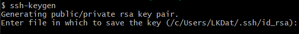

    Пример пути: /d/GB/repoHub/repoHub(название файла).

* Указать специальную фразу (необязательно, 2 Enter). 

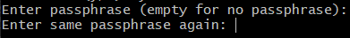

2. В локальном репозитории ввести комманду cat <директория файла с расширением .pub (Искать в выводе после комманды в шаге 1.2)>.

3. Копируем выведенный ключ.

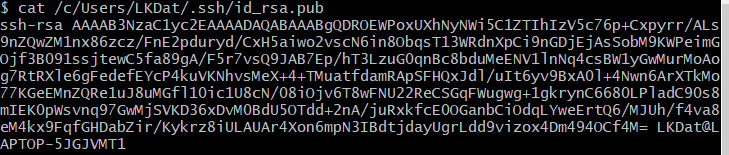

**На GitHub:** 

4. Add SSH key:
    
* Нажать на аватар слева:

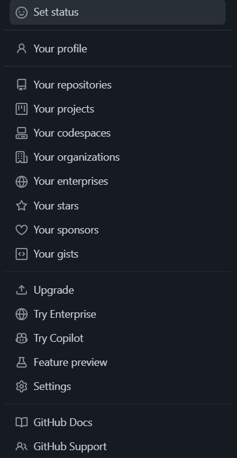

* Нажать на Settings: 

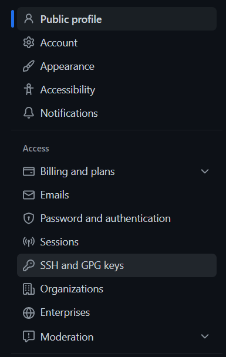

* Нажать на New SSH Key:

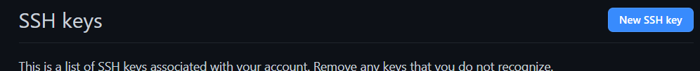

* Нажать на Add SSH Key: 

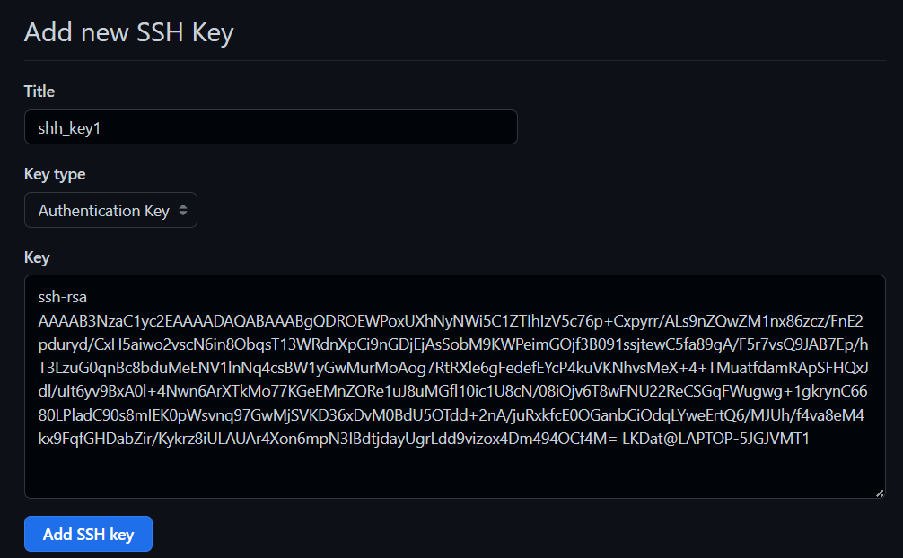

5. Подтвердить пароль на аккаунте.

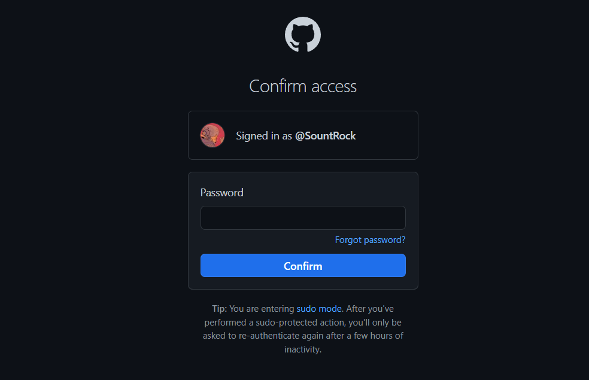

8. Переходим в репозиторий. Code -> SSH, копируем содержимое.

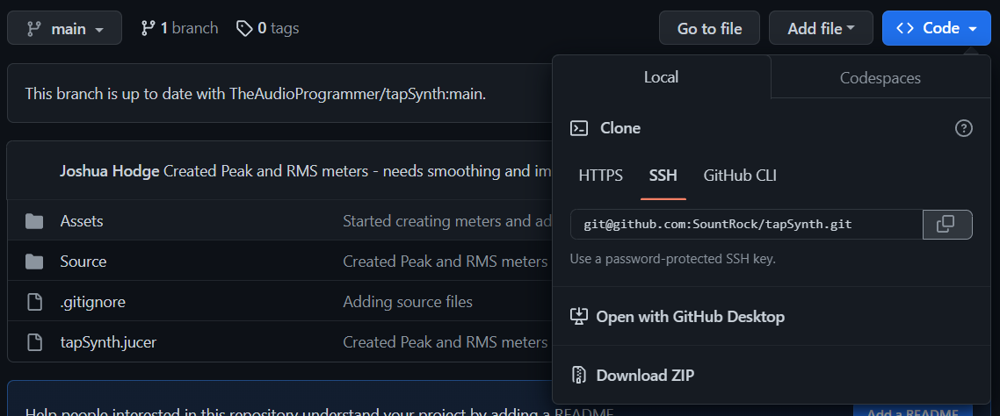

10. Подключаем в локальный репозиторий:
git clone “(ссылка SSH)” “(название папки в которую скопируем  репозиторий).

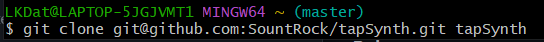

#### Способ 2: 
**На GitHub:** 
1. Создать новый репозиторий.
2. В пункте “…or push an existing repository from the command line” скопировать все комманды. Там будет примерно такое:
*git remote add origin https://github.com/SountRock/gitLinks2.git*
*git branch -M main*
*git push -u origin main*

**В локальном репозитории:**

3. Ввести все эти комманды. 

#### Способ 3: 
**На GitHub:** 
1. Создать новый репозиторий.
2. Переходим в репозиторий. Code -> HTTPS, копируем содержимое.

**В локальном репозитории:**

3. Ввести  *git clone git@github.com:SountRock/tapSynth.git tapSynth*

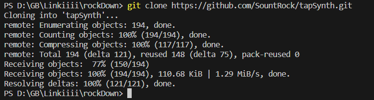

### Отправка данных на удаленный репозиторий 

Для этого используется комманада *git push*. 

#### Удаление веток в удаленном репозитории 

*git push --delete origin* <ветка1> <ветка2>  …  – удаляет указанные ветки в удаленном репозитории.

### Получение данных из удаленнх репозитория 

Для этого используется комманада *git pull*.

### Fork 

Форк (Fork) — собственное ответвление (fork) какого-то проекта. Это означает, что GitHub создаст вашу собственную копию проекта, данная копия будет находиться в вашем пространстве имён, и вы сможете легко делать изменения путём отправки (push) изменений.

Для того, чтобы получить копию проекта нам нужно перейти на страничку проекта и нажать на Fork. 

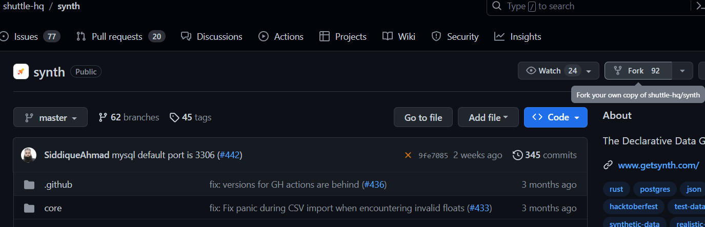

После вам предложат назвать копию. 

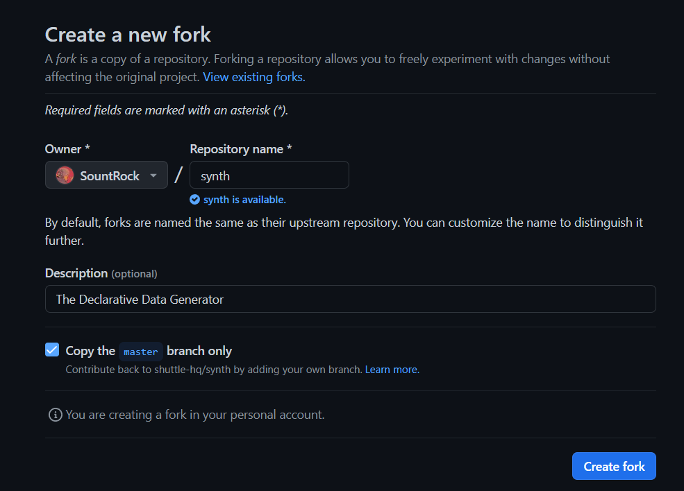

Если вы определились с названием, нажимаем Create Fork. После завершения копирования вы получите нужную вам копию.

### Pull request 

После того как вы отправите новые данные на удаленную копию, на страничке это копии появиться опция Compere & pull request.

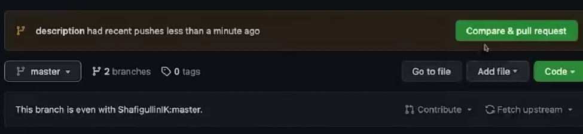

Если вы ее выберите то, внесенные вами изменения будут отправлены в качестве пакета обновлений автору проета. 

Но перед отправкой вам предложат написать описание к вашим изменениям.

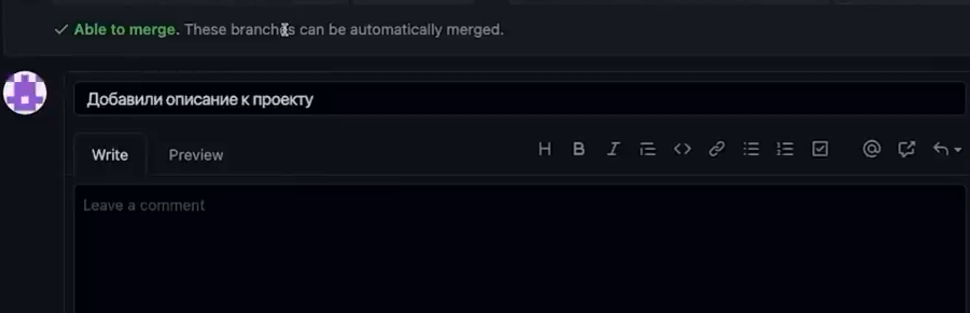

Или можно зайти во вкладку Pull Requests и нажать на New Pull Request.

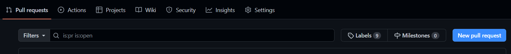

### Codespaces 

Codespaces - это VSCode в браузере, запущенный в заранее описанном окружении (devcontainer) или в стандартном, в который входит python, node.js, Docker и прочее. Все это крутится в облаке и бесплатно за первые 60 часов в месяц.

#### Как попасть в Codespaces 

Достаточно просто открыть необходимый вам репозиторий и нажать на яркую зеленую кнопку code, перейти в codespaces и выбрать Create codespace on main. 

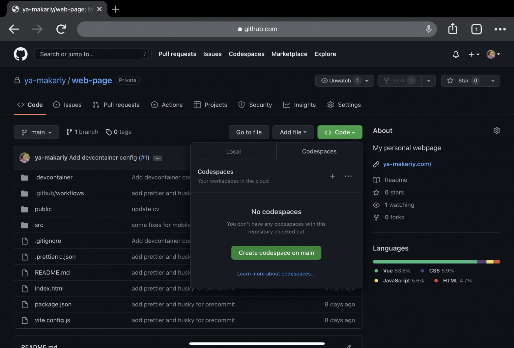

#### Devcontainers 

devcontainers - расширение для VSCode, которое позволяет использовать Docker-контейнер, как полнофункциональное окружение для разработки.

Самый простой способ создать конфиг — запустить стандартный codespaces, найти в списке команд VSCode  Codespaces: Add Dev Container Configuration Filesи выбрать в выпадающем меню все, что тебе нужно в проекте, например:

>{\
> "name": "Node.js",\
>	"image": "mcr.microsoft.com/devcontainers \javascript-node:16",\
>"features": {}\
>}

### Возможные ошибки 

#### Если возникает ошибка fatal: Could not read from remote repository 

В локальном репозитории: 
1. *eval `ssh-agent -s`.* 
2. *ssh-add* <директория пути для ssh>.

#### Если .gitignore не работает 

Способ 1:\
Ввести: 
1. *git rm -r  --cached .*
2. *git add*

Способ 2:
1. Удалить нужные файлы из индеса с помощью *reset* <имя файла 1> <имя файла 2> ...
2. Пересозадть файл *.gitignore*

## Дополнительные материалы 

[30 команд Git, необходимых для освоения интерфейса командной строки Git](https://habr.com/ru/companies/ruvds/articles/599929/)

[Git для новичков (часть 1)](https://habr.com/ru/articles/541258/)

[Git для новичков (часть 2)](https://habr.com/ru/articles/542616/)

[Работа с удалёнными репозиториями](hhttps://git-scm.com/book/ru/v2/Основы-Git-Работа-с-удалёнными-репозиториями)

[GitHub Codespaces](https://habr.com/ru/companies/akbarsdigital/articles/703554/)