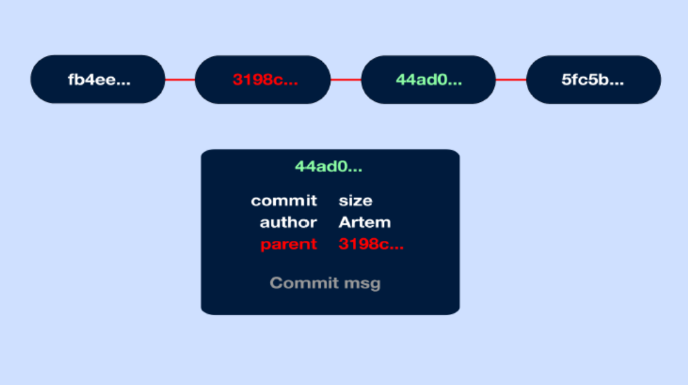

# Инструкция для работы с Git и удалёнными репозиториями

Что такое Git? Git - это одна из реализаций распределённых систем контроля версий, имеющая как и локальные, так и удалённые репозитории. Является самой популярной реализацией систем контроля версий в мире. В этом файле мы рассмотрим основы работы с гит и с удалёнными репозиториями (на примере GitHub).

Как работает гит? Каждый раз, когда мы сохраняем состояние проекта, Git запоминает как выглядит каждый файл в этот момент времени, как бы делая снимок всего проекта (замораживая его) и сохраняет ссылку на этот снимок, его еще можно назвать коммитом (commit).

Каждый раз, когда Вы делаете коммит, Git сначала вычисляет хеш сумму этого коммита и только потом сохраняет информацию. При этом в коммите есть ссылка на предыдущий коммит - его хеш сумма. Так Git обеспечивает целостность истории изменений. Поэтому даже если кто-то хоть что-нибудь изменит в любом коммите из цепочки, его хеш сумма полностью изменится и придется переписывать уже всю последующую историю коммитов, что не останется незамеченным.

# Разделы инструкции:

- [Подготовка репозитория](#подготовка-репозитория)
- [Создание коммитов](#создание-коммитов)
- [Перемещение между сохранениями](#перемещение-между-сохранениями)
- [Журнал изменений](#журнал-изменений)
- [Ветки в Git](#ветки-в-git)
- [Создание репозитория GitHub](#создание-репозитория)
- [Работа с удалённым репозиторием](#работа-с-удалённым-репозиторием)
- [Предложение и вливание изменений в сторонний репозиторий](#предложение-и-вливание-изменений-в-сторонний-репозиторий)

# Подготовка репозитория

Что такое репозиторий? Это просто корневая папка с файлами и вложенными директориями вашей программы. Загрузить в репозиторий можно всё что угодно, но предполагается, что вы будете хранить в нём файлы с исходным кодом и какие-нибудь дополнительные материалы — допустим, необходимую для GUI или вёрстки графику (картинки, иконки и тому подобное).

Для создание репозитория необходимо выполнить команду `git init` в папке с репозиторием, и у вас создастся репозиторий (появится скрытая папка `.git`)

# Запись изменений в репозиторий

## Git add

Для добавления измений в коммит используется команда *git add*. Чтобы использовать команду *git add* напишите git add <имя файла>

## Просмотр состояния репозитория

Для того, чтобы посмотреть состояние репозитория используется команда *git status*. Для этого необходимо в папке с репозиторием написать *git status*, и Вы увидите были ли измения в файлах, или их не было.

## Создание коммитов

Само внесение изменений называется «коммит» (от английского commit — совершить), у него есть временная метка и хеш-сумма. Для того, чтобы создать коммит (сохранение) необходимо выполнить команду *git commit*. Выполняется она так: `git commit -m "<сообщение к коммиту>"`. Все файлы для коммита должны быть ДОБАВЛЕНЫ и сообщение к коммиту писать ОБЯЗАТЕЛЬНО.

# Перемещение между сохранениями

Для того, чтобы перемещаться между коммитами, используется команда *git checkout*. Используется она в папке с пепозиторием следующим образом: `git checkout <номер коммита>`

# Журнал изменений

Для того, чтобы посмтреть все сделанные изменения в репозитории, используется команда *git log*. Для этого достаточно выполнить команду *git log* в папке с репозиторием

# Ветки в Git

В ветки группируются изменения и обновления — допустим, одна главная ветка (по умолчанию создаётся **main**) и одна **beta**. Ветки независимы друг от друга, но при желании их можно объединять (merge — слияние) — даже если между ними есть разница в коде.

## Создание ветки

Для того, чтобы создать ветку, используется команда git branch. Делается это следующим образом в папке с репозиторием: `git branch <название новой ветки>`

## Слияние веток

Для того чтобы дабавить ветку в текущую ветку используется команда *git merge*

## Удаление веток

Для удаления ветки ввести команду `git branch -d 'name branch'`

# Создание  удалённого репозитория

*Чтобы разместить проект на GitHub, необходимо создать репозиторий, чтобы он функционировал.*

В репозиториях GitHub можно хранить различные проекты, включая проекты с открытым исходным кодом. С проектами с открытым исходным кодом вы можете обмениваться кодом для создания лучшего и более надежного программного обеспечения. Вы можете использовать репозитории для совместной работы с другими пользователями и отслеживания своей работы.

* В правом верхнем углу любой страницы воспользуйтесь  выпадающим меню и выберите Новый репозиторий.

* Введите короткое, запоминающееся название для вашего репозитория. Например, "hello-world".

* При желании добавьте описание вашего репозитория. Например, "Мой первый репозиторий на GitHub".
* Выберите видимость репозитория. (публичный или приватный)
* Нажмите Создать репозиторий.

# Работа с удалённым репозиторием

Что такое GitHub и чем он отличается от Git? GitHub — это облачная платформа для хостинга IT-проектов и совместной разработки, под капотом которой находится популярная система контроля версий Git, а также полноценная социальная сеть для разработчиков.

Здесь можно найти кучу open-source-проектов на разных языках и поучаствовать в них, разместить своё портфолио с примерами кода, чтобы приложить ссылку к резюме, подглядывать в открытых проектах интересные архитектурные решения, смотреть, как опытные разработчики пишут код, и скачивать огромное количество полезных в разработке и бесплатных инструментов для разработки.

Придя практически в любую IT-компанию, вы столкнётесь с тем, что код где-то хранится — и в подавляющем большинстве случаев этим «где-то» будет именно GitHub. У GitHub есть довольно известный конкурент — GitLab, он тоже основан на Git, но это разные платформы разных компаний, хотя их функциональность очень похожа.

А ещё не стоит путать GitHub и Git. GitHub — лишь одна из реализаций системы контроля версий Git, в которую добавлено много удобных инструментов и возможностей (те же комментарии, issues, гиперссылки, форматированный текст и тому подобное). Помните, GitHub можно использовать и без знания Git (обратное тоже верно).

Ну как, звучит круто? Тогда приступайте к нашему гайду о том, как пользоваться GitHub, чтобы во всём разобраться и вообще понять, нужен ли он вам прямо сейчас.

## Клонирование репозитория

Копировать внешний репозиторий на свой ПК можно командой *git clone*

>Команда git clone составная: она не только загружает все изменения, но и пытается слить  все ветки на локальном компьютере и в удаленном репозитории.

## Получение изменений из удаленного репозитория

Что скачать изменения из удалённого репозитория необходимо выполнить команду *git pull*

>Эта команда позволяет скачать все из текущего репозитория и автоматически сделать merge с нашей версией

## Отправка изменений во внешний репозиторий

Перенос изменений-коммитов из локального репозитория (на вашем ПК) на удалённый (remote repository, то есть в данном случае на GitHub) называется «пуш» (push — от английского «толкать» (дословно — «проталкивать» изменения)).

Отправить свою версию репозитория во внешний репозиторий поможет команда *git push*. **При первом её использовании нужна авторизация.**

>Эта команда позволяет отправить нашу версию репозитория на внешний репозиторий. **ТРЕБУЕТ АВТОРИЗАЦИИ на внешнем репозитории.**

# Предложение и вливание изменений в сторонний репозиторий

В больших компаниях один ответственный за проект создает аккаунт. Другие пользователи дают команду *pull request*. Предлагать изменения на GitHub нужно в отдельной ветке. Сначала пользователь копирует репозиторий на свой компьютер, делает fork репозитория, затем клонирует версию на своём ПК, создаёт ветку с предлагаемыми изменениями, отправляет изменения командой push в свой аккаунт на GitHub и даёт команду *pull request*.
#### pull request

* команда для предложения изменений
* запрос на вливание изменений в репозиторий
#### Как сделать pull request

* Делаем ответвление репозитория с помощью **fork**
* Делаем *git clone* свой версии репозитория
* Создаем новую ветку и в НЕЕ вносим свои изменения
* Фиксируем изменения (делаем коммиты)
* Отправляем свою версию в свой GitHub
* На сайте GitHub нажимаем кнопку **pull request**